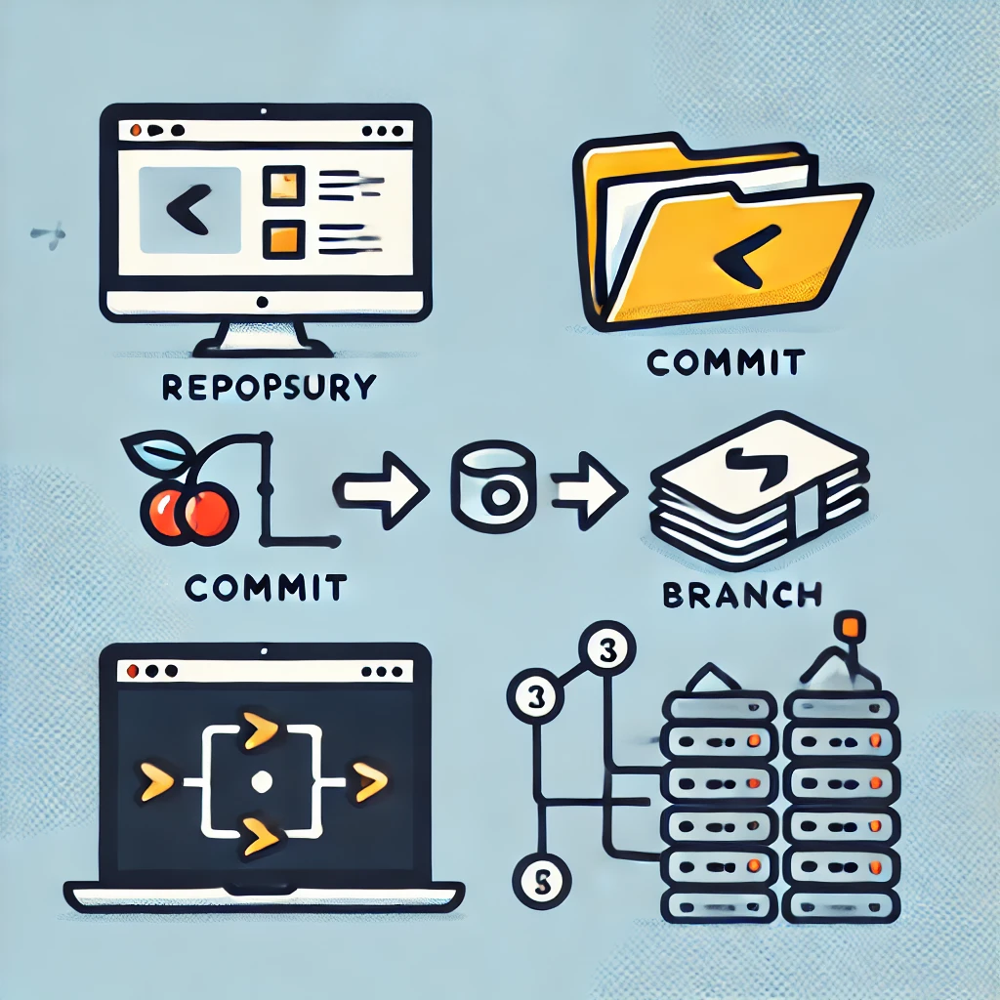

# Git: A Powerful Version Control System

**Git** is a powerful version control system that revolutionizes how developers manage and collaborate on code projects. Here's why it's essential:

## Key Features

- **Track Changes**: Monitor modifications in your codebase over time.
- **Version Management**: Maintain multiple versions of your project simultaneously.
- **Collaboration**: Facilitate seamless teamwork among developers.
- **History Recording**: Create a comprehensive log of project evolution.
- **Revert Capabilities**: Easily return to previous states when needed.
- **Change Analysis**: Explore and understand what has been modified and by whom.
- **Distributed System**: Every developer has a complete project copy, enabling offline work.

## Why Learn Git?

Learning Git is **crucial for web developers** as it:

1. Introduces best practices for code management
2. Enhances team collaboration skills
3. Provides a safety net for experimentation

## Git Tutorial Overview

In a comprehensive Git tutorial, you'll master:

1. **Core Concepts**:

   - Repositories
   - Commits
   - Branches
   - Merges

2. **Essential Skills**:

   - Setting up Git in a project
   - Making your first commit
   - Viewing and managing project history
   - Branching for independent feature development
   - Merging branches back into the main project

3. **Collaboration Techniques**:
   - Using Git platforms like GitHub
   - Pushing and pulling code
   - Contributing to open-source projects
   - Engaging in code reviews

By mastering Git, you'll **streamline your development process** and **elevate your collaboration skills**, making you a more efficient and valuable developer in any team setting.

## CORE CONCEPTS

### **Repository**

A Git repository is where your project’s files are tracked. It's like a project folder that stores your code and all the historical versions of it. You can create a local repository on your computer, or clone one from a remote source like GitHub. This is the starting point when you initialize Git with `git init`.

### **Commit**

A commit is a snapshot of your project at a particular moment. Every time you make meaningful changes, you commit them using `git commit`. This creates a historical record of your changes, allowing you to revert back if necessary. Think of it like saving a version of your document.

### **Branch**

A branch represents an independent line of development. By default, you work on the main branch, but you can create new branches to work on features or bug fixes without disturbing the main code. You can later merge these branches back into the main code when ready.

### **Remote Repositories**

Remote repositories are hosted versions of your project, stored on platforms like GitHub or GitLab. You can push your changes to a remote repository or pull changes others have made. This enables collaboration and version control for teams.

The accompanying image above visually represents these key concepts: repository, commit, branches, and remote repositories to help grasp them better.

## CLI CHEAT SHEET

### **Getting Started**

- `git init` – Initialize a new Git repository.
- `git clone [url]` – Clone a repository from a remote server.

### **Working with Changes**

- `git status` – Show the current status of files (staged, unstaged, untracked).
- `git add [file]` – Stage a file for commit.
- `git add .` – Stage all modified and new files for commit.
- `git commit -m "[message]"` – Commit the staged files with a message.
- `git commit --amend` – Modify the most recent commit (e.g., to change the message).

### **Branching and Merging**

- `git branch` – List all branches in the repository.
- `git branch [branch-name]` – Create a new branch.
- `git checkout [branch-name]` – Switch to the specified branch.
- `git merge [branch-name]` – Merge the specified branch into the current branch.
- `git branch -d [branch-name]` – Delete a branch.

### **Remote Repositories**

- `git remote -v` – List the remote repositories.
- `git fetch` – Download changes from a remote repository without applying them.
- `git pull` – Fetch and merge changes from a remote repository.
- `git push [remote-name] [branch]` – Push local commits to the remote repository.

### **Undoing Changes**

- `git checkout -- [file]` – Discard changes to a file in the working directory.
- `git reset [file]` – Unstage a file but keep its changes.
- `git reset --hard [commit]` – Reset the entire working directory to a specific commit, discarding all changes after it.

### **Viewing History**

- `git log` – Show the commit history.
- `git log --oneline` – Display a simplified, one-line-per-commit history.
- `git diff` – Show changes between the working directory and the index (staged files).
- `git diff --staged` – Show changes between the index and the last commit.

### **Stashing Changes**

- `git stash` – Temporarily save changes without committing.
- `git stash pop` – Apply the most recent stashed changes.

### **Tagging**

- `git tag` – List all tags.
- `git tag [tag-name]` – Create a new tag.
